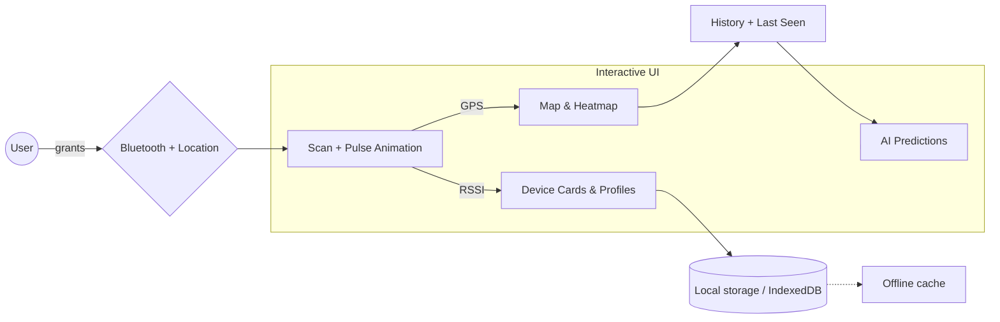
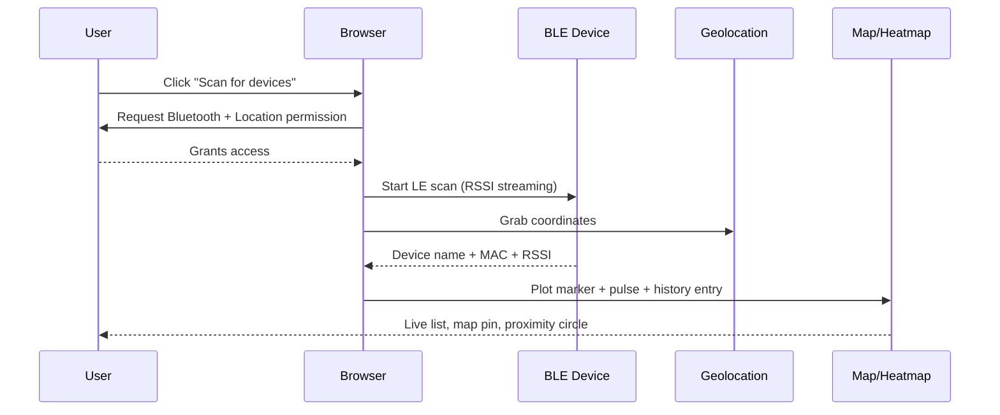

# MyBTLocator
> Web-based Bluetooth tracker with live scanning, device profiles, and rich mapping.

    

## Why this repo?
- **Live Bluetooth scanning** with Web Bluetooth API and RSSI-driven proximity cues.
- **Interactive visuals**: device cards, animated signal pulses, map markers, and heatmaps.
- **Profile richness**: names, types, colors, emoji, notes, history, and predictions.
- **Responsive UI** using Radix, Tailwind v4, motion (Framer Motion), and Leaflet.

## Quick start
1. **Requirements:** Chrome/Edge desktop, Bluetooth + Location enabled, Node 20+.
2. **Install:** `npm install`
3. **Run dev server:** `npm run dev` (defaults to http://localhost:5000)
4. **Build:** `npm run build`  
5. **Preview built app:** `npm run preview`

Need a 30-second tour?

- Click **Scan for Devices** → grant Bluetooth + location permissions.  
- Watch the **animated signal pulse** and live device list populate.  
- Open a device card to set name, type, color, emoji, and notes.  
- Jump to **Map** for last-known locations, **Heatmap** for density, and **Predictions** for likely next sightings.

## At a glance (visuals)

## Feature set
- **Scanning:** Animated pulse, live RSSI, duplicate MAC handling, empty-state guidance.
- **Profiles:** Custom names, types, colors, emoji, notes, badges, and quick actions.
- **Mapping:** Leaflet map, colored markers, proximity rings, recentering, offline fallback.
- **Heatmap:** Density layer with adjustable radius/blur/intensity for all or per-device views.
- **History:** Timeline of detections with timestamps, signal, and coordinates.
- **Predictions:** Pattern detection + confidence scores for likely next sightings.
- **Accessibility:** High-contrast palette, keyboard-friendly components, tooltips for metrics.

## UI layout (desk & mobile)
- **Tabs:** Devices · Map · Heatmap · Radar · History · Predictions.
- **Cards:** Hover glow → selected border → muted when out-of-range.
- **Controls:** Sticky scan button, floating map controls, color-picker for markers.
- **Mobile:** Bottom tab bar, slide-up sheet for details, full-bleed map on Map tab.

## Data, storage, and privacy
- Uses **browser-side storage** (local storage/IndexedDB) for device profiles and history.
- No cloud backend by default; data stays on your device unless you add one.
- Location + Bluetooth permissions are required only for scanning and mapping.

## Scripts
| Task | Command |
| --- | --- |
| Install deps | `npm install` |
| Dev server | `npm run dev` |
| Lint | `npm run lint` |
| Build | `npm run build` |
| Preview build | `npm run preview` |

## Troubleshooting
- **No devices found:** Ensure Bluetooth is on and device is discoverable; retry scan.
- **Permission denied:** Refresh and re-run scan; Chrome/Edge only (Web Bluetooth).
- **Geolocation blocked:** Manually allow location or fall back to IP-based location.
- **Lint error about config:** ESLint v9 expects `eslint.config.js`; repo currently omits it.

## Design language
- Palette: deep slate backgrounds with electric blue and cyan accents.
- Typography: Space Grotesk (UI), Inter (body), JetBrains Mono (data).
- Motion: subtle pulses for scanning, smooth view transitions, responsive map interactions.

## Contributing (fast lane)
- Keep changes small and focused.
- Run the relevant script(s) above before opening a PR when code changes are made.
- Document UX-impacting updates with screenshots or short clips where possible.
